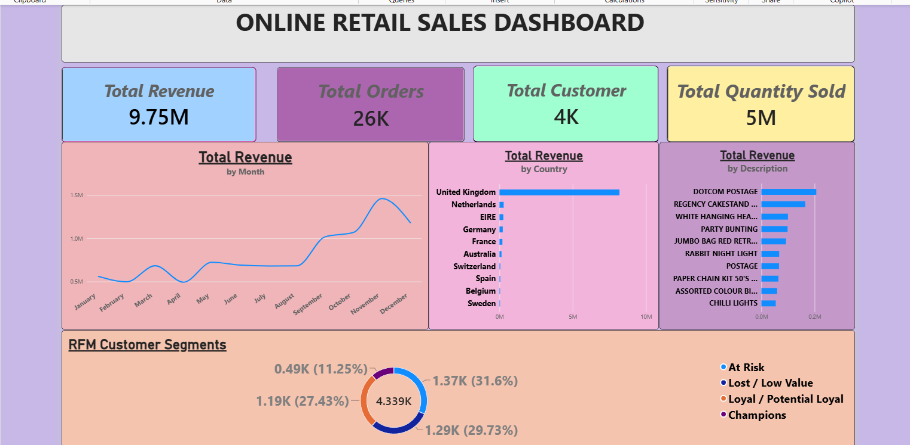
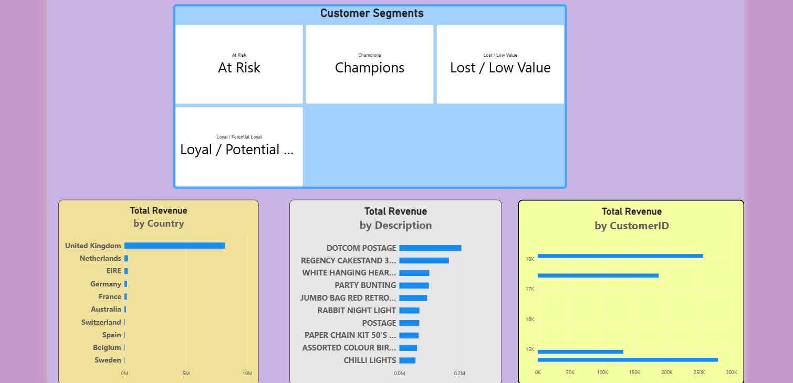

# E-commerce Analysis using Power BI

## 📊 Project Overview

This project analyzes online retail sales data using Microsoft Power BI to understand sales performance, customer behavior, and customer segments.

The dashboard provides an interactive view of key business metrics and uses RFM (Recency, Frequency, Monetary) analysis to segment customers.

## 🎯 Objectives

- Analyze overall sales performance
- Track revenue and quantity sold
- Understand customer purchasing behavior
- Identify customer segments using RFM analysis
- Create an interactive Power BI dashboard
- Generate insights that can support business decision-making

## 🛠️ Tools & Technologies

- Microsoft Power BI
- Power Query
- DAX
- RFM Analysis
- Excel

## 📁 Dataset

The project uses an online retail transaction dataset containing sales transactions and customer information.

Key fields include:

- Invoice Number
- Stock Code
- Description
- Quantity
- Invoice Date
- Unit Price
- Customer ID
- Country

## 📈 Dashboard

### Executive Dashboard

### Detailed Analysis

## 👥 RFM Customer Segmentation

RFM analysis was used to understand customer value based on:

- **Recency** – How recently a customer purchased
- **Frequency** – How often a customer purchased
- **Monetary** – How much a customer spent

The analysis groups customers into meaningful segments such as Champions, Loyal/Potential Loyal, At Risk, and Lost/Low Value.

## 📌 Key Results

- **Total Revenue:** 10.64M
- **Customers analyzed using RFM:** 4,338
- **UK Revenue:** 9.00M
- **Cleaned transaction records:** 522,730

## 🔍 Key Analysis Areas

- Total Revenue
- Total Quantity Sold
- Revenue Trends
- Customer Segmentation
- RFM Analysis
- Country-wise Sales Analysis
- Customer Purchasing Behavior

## 📂 Project Files

| File | Description |
|---|---|
| `Online_Retail_Sales_Analysis.pbix` | Power BI dashboard file |
| `executive_dashboard.png` | Executive dashboard preview |
| `detailed_analysis.png` | Detailed analysis dashboard preview |

## 👩‍💻 Author

**Vishalini R**

B.Tech Artificial Intelligence & Data Science
